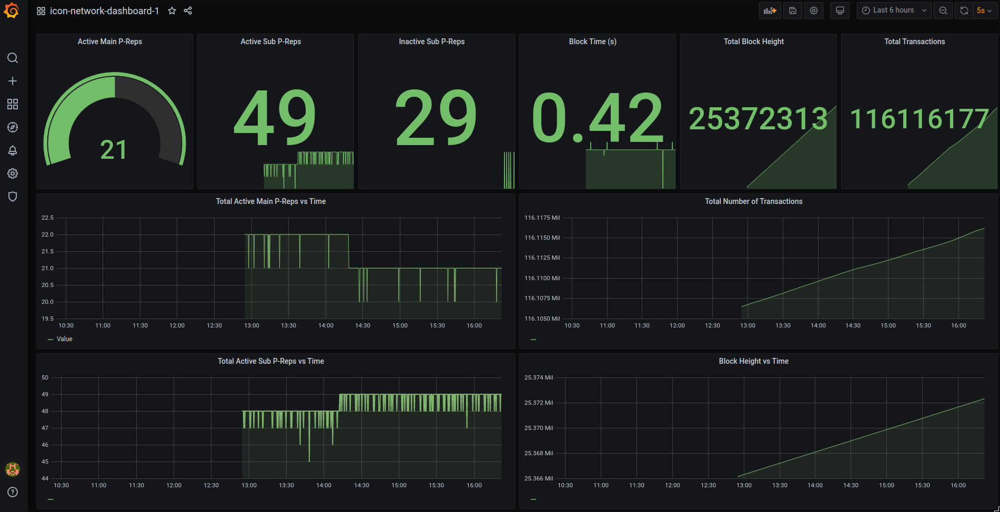

## docker-prometheus-icon

> When using, remember to modify the config files for any production workload. In actual operation, they are overriden in the associated ansible role. 

Modification to [dockprom](https://github.com/stefanprodan/dockprom) with specific configurations for the ICON blockchain. To be used in conjunction with (cachet-docker)[https://github.com/insight-icon/cachet-docker] as a status page for the ICON network. This is setup with Ansible from [this directory](https://github.com/insight-icon/terraform-icon-monitor-aws-cachet/tree/master/ansible/roles/cachet) in the [terraform-icon-monitor-aws-cachet](https://github.com/insight-icon/terraform-icon-monitor-aws-cachet) which is in turn deployed from [terragrunt-icon-monitor](https://github.com/insight-icon/terragrunt-icon-monitor). 

Includes: 
- (icon-network-exporter)[https://github.com/insight-icon/icon-network-exporter] - Exports additional ICON specific metrics 
    - On a per nodes basis
        - Block height
        - Time in seconds per block 
        - State (Vote / Watch / BlockSync)
    - On a network wide basis
        - Highest block height 
        - Time in seconds per block 
        - Number of main p-reps active 
        - Number of sub p-reps down 
- Alertmanager
    - WIP
    - Alarms tuned to feed the status page  
- Grafana dashboards
    - WIP 
    - Network wide dashboard and node specific dashboard 

### Related Repos 

- [dockprom](https://github.com/stefanprodan/dockprom)
- [cachet-docker](https://github.com/insight-icon/cachet-docker)
- [terraform-icon-monitor-aws-cachet](https://github.com/insight-icon/terraform-icon-monitor-aws-cachet)
- [terragrunt-icon-monitor](https://github.com/insight-icon/terragrunt-icon-monitor)

